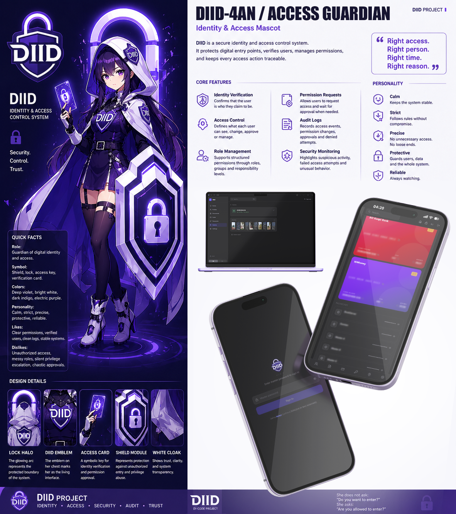

# DIID — Personal Document Vault



A self-hosted, encrypted vault for storing family documents, bank cards, passwords, and certificates. Runs entirely on your own server — no cloud, no third parties.

---

## Features

- **Profiles** — organize everything by person (family members, etc.)
- **Documents** — ID cards, passports, driver's licenses, diplomas, birth certificates, scans and photos with expiry tracking
- **File attachments** — attach a PDF scan to any document; attach a photo with inline preview for photo-type entries
- **Bank cards** — stored with encrypted numbers and CVV, beautiful card UI
- **Passwords** — service credentials grouped by category
- **Keys** — store p12/pfx certificates with encrypted passwords and file download
- **Stashes** — geocached stash entries with coordinates (any format accepted, auto-normalised), description, private note and up to 5 photos per stash; full-screen gallery with zoom & swipe
- **PIN lock screen** — 4-digit PIN overlays the app; auto-locks on page hide; max 5 attempts before automatic logout
- **Decoy PIN** — enter a separate PIN to show a sanitised "nothing to see here" view
- **Field visibility** — per-field control: always visible / tap to reveal / confirm to reveal
- **Search** — instant full-text search across all records
- **Multi-user** — master user creates up to 8 additional accounts; login by password only (no usernames); members can delete their own account
- **EN / RU / KK** — full interface localization (English, Russian, Kazakh) with persistent preference
- **Privacy screen** — hides sensitive data in iOS app switcher
- **Sessions** — view and revoke active login sessions
- **Encryption** — all sensitive fields encrypted at rest with Fernet (AES-128-CBC)
- **Password-only auth** — argon2id hashing, no username needed; system identifies user by password match

## Tech Stack

| Layer | Technology |
|---|---|
| Backend | FastAPI · SQLAlchemy · Alembic · argon2-cffi · cryptography |
| Database | PostgreSQL 16 |
| Frontend | React 19 · TypeScript · Vite · Tailwind CSS v4 |
| State | Zustand · TanStack Query v5 |
| Deployment | Docker · Docker Compose |
| Desktop | Tauri v2 · PyInstaller sidecar · SQLite |

---

## Desktop App

Standalone Windows application — no server required. Data stored locally in `%APPDATA%\DIID\`, encryption key in Windows Credential Manager.

- **System tray** — minimize to tray, About dialog with version info
- **PIN on hide** — auto-locks when closed to tray (not on minimize)
- **Branded installer** — NSIS with custom sidebar image, MSI also available
- **Clean uninstall** — kills processes, optionally removes vault data

Download the latest installer from [Releases](https://github.com/1d1l1r/DIID/releases).

To build from source:

```powershell
cd desktop
powershell -ExecutionPolicy Bypass -File build_win.ps1
```

---

## Quick Deploy (Production)

**Requirements:** server with Docker + Docker Compose installed.

```bash
# 1. Clone
git clone https://github.com/1d1l1r/DIID.git
cd DIID

# 2. Configure environment
cp backend/.env.example backend/.env
nano backend/.env
```

Fill in `.env`:

```env
POSTGRES_PASSWORD=your_strong_db_password

# Generate encryption key:
# python3 -c "from cryptography.fernet import Fernet; print(Fernet.generate_key().decode())"
VAULT_ENCRYPTION_KEY=your_generated_key

# Your domain or server IP (for CORS)
CORS_ORIGINS=["https://yourdomain.com"]

SESSION_EXPIRE_DAYS=30
APP_ENV=production
```

```bash
# 3. Start
docker compose up -d

# 4. Apply database migrations
docker compose exec backend alembic upgrade head
```

Open the app in your browser — you'll be prompted to create a master password on first run.

> **Data lives in named Docker volumes** (`postgres_data`, `uploads`) and persists across restarts and image rebuilds.

---

## Development

### Backend

```bash
cd backend
python -m venv .venv
source .venv/bin/activate  # Windows: .venv\Scripts\activate
pip install -e ".[dev]"

cp .env.example .env  # edit DATABASE_URL to point to local postgres

alembic upgrade head
uvicorn app.main:app --reload
```

API available at `http://localhost:8000` · Swagger UI at `http://localhost:8000/docs`

### Frontend

```bash
cd frontend
npm install
npm run dev
```

App available at `http://localhost:5173`

---

## Updating

```bash
git pull
docker compose up -d --build
docker compose exec backend alembic upgrade head
```

---

## Data Model Overview

| Entity | Fields |
|---|---|
| **Profile** | Name, IIN, phone, birth date, address, tags, note |
| **Document** | Type, country, number, IIN, issued by, dates, note, file attachment (PDF/JPG/PNG) |
| **Card** | Bank, number, expiry, CVV, cardholder, color theme, note |
| **Password** | Service, login, password, URL, category, note |
| **Key** | Name, password, .p12/.pfx file attachment, note |
| **Stash** | Name, latitude, longitude, description, note, images (up to 5) |

All sensitive fields (document numbers, IINs, card numbers, CVVs, passwords, key passwords) are encrypted at rest.

---

## Security Notes

- Keep `.env` out of version control (already in `.gitignore`)
- Use a strong, unique `POSTGRES_PASSWORD` and `VAULT_ENCRYPTION_KEY`
- Put the app behind a reverse proxy (nginx / Caddy) with HTTPS
- `VAULT_ENCRYPTION_KEY` rotation is supported via comma-separated keys (MultiFernet)
- Sessions are invalidated on master password change
- Uploaded files are stored in a Docker volume (`uploads`), not served statically — access requires an active session cookie
- PIN lock runs entirely client-side (hashed in the browser); uses SHA-256 in secure contexts (HTTPS/localhost) and a JS FNV-1a fallback on plain HTTP

---

## License

MIT
